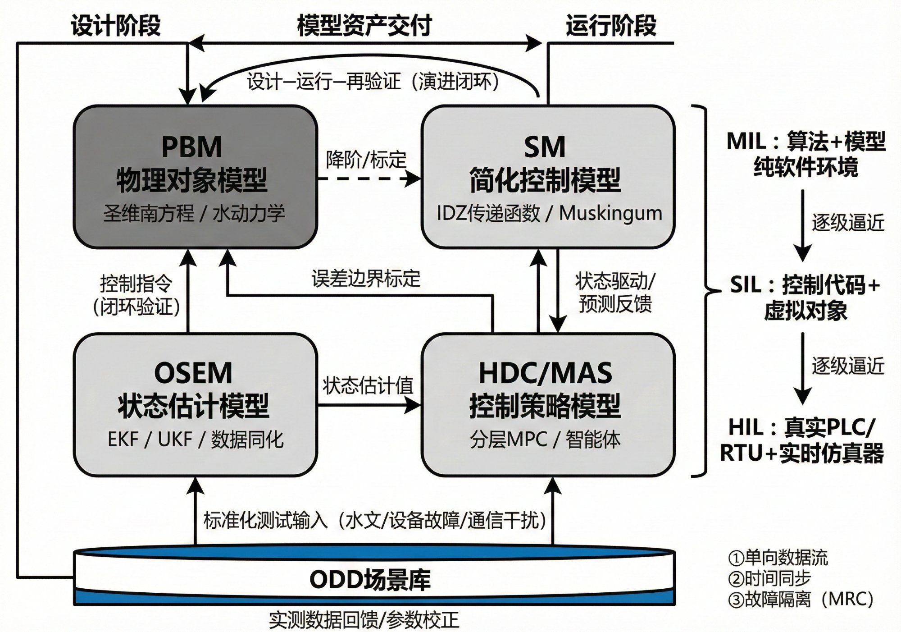

# 面向水网工程的基于模型定义（MBD）方法论（Ⅰ）：内涵与模型体系

**摘要：** 大型水网工程正从建设期迈入体系化运行阶段，但传统设计方法论以"物理结构安全"为核心目标，将调度方案作为设计附件而非核心交付物，导致关键运行参数在设计阶段即锁定系统运行能力——即"设计锁定效应"。针对这一突出矛盾，本文系统梳理了传统设计范式与基于模型的定义（MBD）方法论的演进历程，辨析了水利行业在运行边界定义、在环验证和协同逻辑硬化三方面的方法论缺口。在此基础上，以信息-物理-社会系统（CPSS）认知为基础，阐明了MBD方法论以"可观测性"与"可控性"为设计主线的核心理念，构建了包含物理对象模型（PBM）、面向控制的简化模型（SM）、观测与状态估计模型（OSEM）及控制策略模型（HDC/MAS）在内的四类模型体系及其标准化接口协同机制，并给出了多模型耦合集成的系统级统一仿真验证平台方案。本文为姊妹篇上篇，侧重MBD方法论内涵与模型体系；下篇将在此基础上给出"四层一闭环"总体框架与工程验证实践。

**关键词：** 水网工程；基于模型的定义（MBD）；信息-物理-社会系统（CPSS）；模型体系；分层分布式控制（HDC）；多智能体系统（MAS）；设计锁定效应

**Abstract:** Large-scale water network projects are transitioning from the construction phase to systematic operation. However, the traditional design paradigm, centered on "physical structural safety," treats operational plans as design appendices rather than core deliverables, causing critical operational parameters to lock system capabilities at the design stage — the "design lock-in effect." This paper systematically reviews the evolution of the traditional design paradigm and Model-Based Definition (MBD), identifies three methodological gaps in the water sector, and establishes a four-category model system with standardized interface protocols under the Cyber-Physical-Social Systems (CPSS) framework. As Part Ⅰ of a companion series, this paper focuses on MBD connotations and model taxonomy; Part Ⅱ presents the overall framework and engineering verification.

**Keywords:** water network engineering; Model-Based Definition (MBD); Cyber-Physical-Social Systems (CPSS); model taxonomy; Hierarchical and Distributed Control (HDC); Multi-Agent System (MAS); design lock-in effect

## 引言

大型水网工程已从单一工程建设阶段迈入水资源配置体系化运行阶段[1-2]。随着国家水网工程由输水骨干线向多级分配网络演进，工程系统表现出显著的非线性、时滞性与时空关联特征[1-3]。与一般的工业流程系统或城市管网不同，大型水网具有一系列独特约束：水力过程具有跨越数个数量级的时间尺度差异——对于长距离明渠输水系统，单个渠池的水位响应时间为分钟至小时量级（压力波传播），而全线流量到达传播时间可达十余天量级（质量波传播）[10]；传感器稀疏且分布不均；执行机构（闸门、泵站）受物理行程和安全约束限制；调度规程涉及多利益主体博弈。这些特征使得试错代价远超工业过程控制。

然而，传统设计方法论以"物理结构安全"为核心目标，将调度方案作为设计附件而非核心交付物。关键运行参数——如监测布设方案、控制策略参数、执行机构响应特性——在设计阶段被锁定后即形成"设计锁定效应"，在工程运行期难以系统性修正。

目前，水利行业虽在水动力仿真[4-6]、调度优化[7-9]及自动化控制领域[10-13]形成了丰富的方法与工具体系，但相关研究多侧重于单一环节的独立建模或算法优化，尚未形成将运行边界定义、监测布设、控制逻辑与验证流程纳入一体化闭环的系统方法论。航空航天和汽车行业通过MBD方法论实现了从概念设计到系统验证的全闭环[15]，以模型在环（MIL）—软件在环（SIL）—硬件在环（HIL）构建逐级逼近真实运行的验证体系[14-18]。将该范式在水利行业系统化应用，为复杂水网提供"可定义、可验证、可交付"的系统方法，是本文的核心出发点。

围绕上述问题，近年来提出的"水系统控制论"（Cybernetics of Hydro Systems，CHS）[19]、"自主运行水网"[20]及"在环测试体系"[14]等研究，为形成方法论闭环提供基础。值得注意的是，国际上水利领域的在环验证探索同样处于起步阶段：ASCE灌溉渠道自动化专委会虽建立了标准化MIL测试基准[31]，但仅覆盖少量典型稳态扰动场景，远未形成ODD驱动的系统化验证体系；美国NREL实验室近年为水电机组开发了兆瓦级实时硬件在环仿真平台（RTHEP），但其应用范围限于电力系统并网场景[32]；荷兰Delft大学针对运河网络的分布式MPC控制研究实现了仿真环境下的多区域协调验证[33]，但未扩展至实际控制器在环测试。总体而言，水利行业的在环验证实践普遍停留在"有限典型场景的MIL"阶段，根本原因在于缺乏系统化的ODD定义方法——不知道"应该验证什么"，自然无法开展系统性验证。

本文在此基础上，系统阐述面向水网工程的MBD方法论内涵与模型体系。本文为姊妹篇上篇；下篇[36]将在此基础上给出"四层一闭环"总体框架、关键技术工程链与实践验证。

## 1　两种设计方法论的存在原因与演进历程

传统工程设计方法论以结构安全为核心目标，遵循"荷载假定→结构分析→安全系数校核"的经典范式。这一范式在水利工程中的体现是：以设计洪水、最大引水流量等极端工况为输入，通过水力计算确定断面尺寸、闸门规格等物理参数，以安全系数（或可靠度指标）作为设计合格判据。该范式的核心价值在于保障工程物理结构在极端工况下的"生存安全"，其理论基础成熟、工程经验丰富。

MBD方法论起源于航空航天和汽车工业。其核心理念是：以可执行模型作为工程的唯一权威定义，贯穿从概念设计、详细设计、验证测试到运行维护的全生命周期。ASME Y14.41标准将MBD确立为三维模型驱动的工程定义方式，波音787是全球首架完全基于MBD设计制造的商用飞机。在控制系统领域，MBD通过MATLAB/Simulink工具链实现了"模型即规范"的设计流程，控制策略在虚拟环境中完成开发、验证后，自动生成嵌入式代码部署至实际硬件[15]。

两种方法论并非替代关系，而是互补演进：传统方法论保障物理结构安全，MBD在此基础上进一步保障系统运行能力。对水网工程而言，这一演进尤为迫切——因为水网的价值不在于"建成"，而在于"运行得好"。

## 2　水利行业方法论缺口

水利行业在从"有模型"到"可交付运行能力"的跨越中，面临三方面系统性缺口：

a. 运行边界定义缺口。传统设计以极端工况（如最大过流能力、最高水位）作为安全校核基准，但实际运行中更常面临的是多因素耦合的复杂工况组合——设备部分退化、通信间歇中断、非设计来水过程叠加用水需求突变等。缺乏将"允许运行范围"工程化表达的系统方法，导致运行设计域（ODD）隐含于调度规程而未被显式定义和验证。

b. 在环验证缺口。传统设计中的水力计算和调度仿真虽已普遍，但其本质是独立的数值计算，未形成将监测布设、控制逻辑和执行机构纳入闭环测试的工程规范。当前行业虽已开展部分MIL测试，但由于缺乏ODD概念的指导，现有MIL仅覆盖少数典型场景（如设计流量工况、简单扰动响应），远未实现ODD驱动的系统化场景覆盖。国际上，ASCE灌溉渠道控制算法委员会虽建立了标准化测试渠道（Test Canal 1/2）用于算法基准评估[31]，van Overloop等在美国亚利桑那MSIDD WM渠道实现了MPC的现场部署[34]，Litrico和Fromion在法国和葡萄牙实验渠道上完成了从实验室到实际渠道的控制器验证[35]，但这些工作本质上仍是特定工况下的控制算法验证，而非面向完整运行域的系统化MBD验证。至于SIL/HIL测试，在水利领域国内外均处于初步探索阶段[14,16-18]——这与汽车、航空航天行业已形成标准化V模型验证流程形成鲜明对照。

c. 协同机制的逻辑硬化缺口。大型水网运行需要多工程单元协同配合，但复杂调度规程多以自然语言描述、由人工经验执行。缺乏将协同逻辑转化为可审计、可进化的多智能体规则的标准化路径，一旦工况超出规程预设范围，协同机制难以自适应调整。

事实上，水利行业并非没有"基于模型优化设计"的实践——以水锤计算为代表的动态复核，其本质正是利用瞬变流模型在设计阶段验证工程的运行安全能力，据此优化调压室容积、阀门关闭规律等设计参数。但这类实践局限于物理层安全校核，未扩展至"运行能力"的全面定义与验证。上述三方面缺口的本质在于：传统设计范式不具备"运行能力交付"的方法论支撑。

## 3　MBD内涵与CPSS认知基础

### 3.1　水网系统的CPSS认知

现代大型水网已演化为典型的信息-物理-社会系统（CPSS）[22-23]。在这种认知视角下，水网运行的不确定性不再仅源于物理层面的水力扰动，还包括信息层面的通信中断与量测失真，以及社会层面的调度规程冲突与多主体利益博弈。

CPSS认知为MBD方法论提供了系统性的分析框架：物理层锁定——渠道断面、闸门行程等物理参数一旦确定，系统的可控裕度即被约束；信息层锁定——传感器数量、布设位置和通信架构决定了系统的可观测水平；社会层锁定——调度规程中的权责划分和优先级规则影响多目标协调空间。三层锁定共同构成了"设计锁定效应"的完整机制。识别并量化这三层锁定，正是MBD在设计阶段需要系统解决的核心问题。

### 3.2　从"生存安全"到"运行效能"的范式演进

水利行业长期以来形成的以水锤计算、调压室涌浪分析为代表的动态复核，是水利领域"基于模型优化设计"的经典实践：工程师利用瞬变流数值模型，模拟闸门关闭、机组甩负荷等极端事件下的水力过程，据以确定管道壁厚、调压室尺寸等安全参数。这本质上是对物理层"生存安全"的模型化校核。

随着水网工程向自主运行方向演进[20]，设计范式需从关注"生存安全"向保障"运行效能"进行深度跨越：不仅需验证极端工况下的工程安全性，更需评估常态化运行中的调节效能与多目标协同。这要求设计范式系统纳入控制策略有效性、监测网络信息充分性及多工程单元协调能力等维度——即MBD所涵盖的完整运行能力定义。

### 3.3　数字孪生水利的全链条一体化诉求

数字孪生系统实现高效运行（乃至自主运行）的前提是决策的高可信度。MBD方法论将运行能力验证过程转化为结构化的证据体系，其目标是针对ODD内的各类典型场景，形成完整的MIL/SIL/HIL分级验证报告。这不仅为数字孪生系统的在线决策提供可信度背书，更为水网的监管审批和责任认定提供可审计依据[14]。

从全链条视角看，MBD弥合了设计与运行之间的"信息断裂带"：设计阶段的模型资产（几何模型、水力模型、控制模型）通过标准化接口，无缝迁移至运行阶段的数字孪生平台；运行阶段的实测数据反向驱动模型参数校正与控制策略迭代，形成"设计—运行—再设计"的持续进化闭环。管光华等[26]针对南水北调中线构建的实时自校正数字孪生模型，以及王忠静等[27]提出的灌区全渠系智能控制方法，初步展示了这一闭环机制的可行性。

### 3.4　MBD的设计主线："可观测性"与"可控性"

MBD将系统的"可观测性"与"可控性"确立为设计主线[19,21]。可观测性要求在有限传感器条件下重构系统运行状态，可控性要求实现对系统运行状态的有效干预。

水网系统中，渠池水力延时大、传感器稀疏且存在量测噪声，这使得水位/流量的精确状态估计成为决策基础。MBD通过将观测布设与控制策略纳入统一设计空间，确保设计交付的系统具有"看得清、控得住"的基本运行能力。具体而言：在设计阶段即通过可观测性分析优化传感器布设方案，通过可控性分析验证执行机构配置是否满足全工况调节需求。

## 4　模型体系的工程指代与功能分工

水利工程语境下，MBD中的"模型"并非单一数学方程，而是由功能互补、接口标准化的四类协同组件构成的模型体系（表1）。

### 4.1　物理对象模型（PBM）

物理对象模型（PBM）基于圣维南方程（明渠非恒定流）或水锤方程（有压瞬变流），对水力过程进行高保真仿真。PBM是在环验证中的"虚拟被控对象"，其精度直接决定验证结论的可信度[4-5]。在MIL阶段，PBM提供完整的物理响应；在HIL阶段，PBM运行于实时仿真器，替代真实物理系统与控制硬件交互。

### 4.2　面向控制的简化模型（SM）

面向控制的简化模型（SM）是通过模型降阶、系统辨识或线性化等方法从PBM中提取的低阶模型[24-26]。在水网应用中，典型的SM包括基于积分延迟（ID）模型[25]的渠池传递函数——管光华等[28]将ID模型推广至含多分水口的复杂渠系并进行了系统验证、基于Muskingum法的河道汇流简化等。SM满足实时优化与预测控制的计算实时性要求，是模型预测控制（MPC）等先进控制算法的直接载体[10-11]。管光华团队进一步将分布式MPC与ADMM算法结合，实现了树状渠系的多区域协调控制[29]。PBM与SM之间形成"校准—验证"循环：SM从PBM降阶得到并由PBM验证精度，SM的简化误差边界由PBM仿真标定。

### 4.3　观测与状态估计模型（OSEM）

观测与状态估计模型（OSEM）基于卡尔曼滤波、粒子滤波等算法，融合稀疏传感器量测与SM预测，重构系统完整状态向量。OSEM是连接"感知"与"决策"的关键桥梁：其输出的状态估计驱动SM预测和控制策略决策。OSEM的设计必须与传感器布设方案协同——这正是MBD将监测布设纳入统一设计空间的方法论基础。

### 4.4　控制策略模型（HDC/MAS）

控制策略模型基于OSEM输出的状态估计和SM提供的预测能力，生成满足ODD边界约束的控制指令序列。

当前工程实践以分层分布式控制（HDC）架构为主。HDC的核心特征为"战略层集中优化+战术层协调分配+现场层分布式执行"的三层解耦结构[10-13]。战略层基于SM和长时间尺度预报信息进行全局优化；战术层将全局优化目标分解为各工程单元的局部控制目标，并协调单元间的水力耦合约束；现场层各控制器独立执行局部控制任务，同时维护安全闭锁逻辑。三层之间通过标准化接口传递控制目标和状态反馈，实现纵向解耦与横向协调的统一。

多智能体系统（MAS）是HDC向更高自治层级的自然演进方向[20]。MAS将水网各工程单元建模为具有自主感知、决策与协商能力的智能体，通过显式协商协议实现协同——相比HDC的层级指令传递，MAS增添了同层级智能体之间的横向协商与自适应组织重构能力。

需要强调的是，HDC与MAS为演进关系而非替代关系：HDC提供成熟的层级结构基础，MAS在此基础上叠加协商能力与自适应组织机制。当前工程实践普遍处于HDC阶段，向MAS跨越需解决通信协议标准化、协商收敛性保证以及多智能体在环验证等关键问题。

表1　MBD模型体系的四类组件及其功能分工

| 模型类型 | 数学基础 | 工程功能 | 在环验证角色 | 典型算法/方法 |
|---------|---------|---------|------------|-------------|
| PBM | 圣维南方程/水锤方程 | 高保真水力仿真 | 虚拟被控对象 | 有限差分/有限体积 |
| SM | 降阶/辨识/线性化 | 实时预测与优化 | 预测控制内核 | ID模型/Muskingum/MPC |
| OSEM | 卡尔曼滤波/粒子滤波 | 状态重构与融合 | 感知-决策桥梁 | EKF/UKF/数据同化 |
| HDC/MAS | 分层优化/协商协议 | 协同控制与决策 | 待验证控制逻辑 | 分层MPC/BDI智能体 |

## 5　多模型耦合集成与统一仿真平台

上述四类模型通过标准化接口协同工作，构成系统级统一仿真验证平台（图1）。

PBM与SM构成"校准—验证"循环：SM从PBM降阶得到，PBM仿真标定SM的简化误差边界。OSEM输出驱动SM预测和控制策略决策。控制策略生成的指令经PBM闭环验证后确认效果。在SIL阶段，控制策略代码与SM、OSEM共同运行于软件环境，PBM提供虚拟被控对象；在HIL阶段，控制策略运行于真实PLC/RTU硬件，通过工业通信网络与运行于实时仿真器的PBM交互。

模型间的耦合接口设计遵循三项原则：（1）单向数据流原则——每一对模型之间的数据传递方向唯一确定，避免循环依赖；（2）时间同步原则——各模型运行步长的公约数作为系统同步时钟，保障异步模型的一致性；（3）故障隔离原则——任一模型异常时，其下游模型可切换至安全降级模式（MRC），不引发级联失效。

场景与环境模型作为统一仿真平台的底层驱动，由ODD边界库生成标准化的测试输入（水文过程、设备故障、通信干扰及其组合工况），为MIL/SIL/HIL各阶段提供一致的场景激励。

图1　"多学科模型独立+系统级统一仿真验证"的底座能力示意

Fig.1　Schematic diagram of the foundational capability of "independent multidisciplinary models + unified system-level simulation verification"

同时，统一仿真平台还承担设计阶段与运行阶段之间的桥梁功能：设计阶段的模型资产（含参数集、验证报告）通过标准化接口交付至运行期数字孪生平台；运行阶段的实测数据回馈至仿真平台进行参数动态校正，形成"设计—运行—再设计/再验证"的持续进化闭环。

## 6　结论与展望

本文作为姊妹篇上篇，系统阐述了面向水网工程的MBD方法论内涵与模型体系，主要结论如下：

a. 辨析了传统设计范式与MBD方法论的演进关系。两种方法论互补演进而非替代：传统方法论保障物理结构安全，MBD在此基础上进一步保障系统运行能力。水利行业面临运行边界定义、在环验证和协同逻辑硬化三方面方法论缺口，本质在于传统设计范式不具备"运行能力交付"的方法论支撑。

b. 基于CPSS认知，阐明了MBD的核心理念。以"可观测性"与"可控性"为设计主线，识别物理层、信息层和社会层三层"设计锁定效应"，将设计目标从"生存安全"拓展至"运行效能"。

c. 构建了四类模型协同体系。PBM（高保真仿真）、SM（实时预测控制）、OSEM（状态估计融合）、HDC/MAS（协同决策），通过标准化接口形成统一仿真验证平台。明确了HDC与MAS的演进关系：HDC提供成熟层级结构，MAS叠加协商与自适应能力。

MBD方法论对所有水网工程普遍适用：对于人工调度为主的工程，提供系统化运行能力评估工具；对于向自主运行演进的工程[20]，提供核心仿真基础。姊妹篇下篇[36]将在此基础上，给出"四层一闭环"总体框架、ODD分层表达机制、关键技术工程链与多工程实践验证。

## 参考文献

[1] 蔡阳.数字孪生水网建设应着力解决的几个关键问题[J].中国水利,2024,(17):36-41.

[2] 夏军,陈进,佘敦先,等.变化环境下中国现代水网建设的机遇与挑战[J].地理学报,2023,78(7):1608-1617.

[3] Kong L, Li Y, Tang H, et al. Predictive control for the operation of cascade pumping stations in water supply canal systems considering energy consumption and costs[J]. Applied Energy, 2023, 341: 121103.

[4] 周立,吴琼,姚仕明,等.江湖系统显式与隐式二维水动力模型比较[J].长江科学院院报,2021,38(12):12-18.

[5] 闫毓,袁赛瑜,唐洪武,等.上海蕰南水利控制片河网水动力再造[J].河海大学学报(自然科学版),2021,49(4):329-334,365.

[6] Yan P R, Zhang Z, Lei X H, et al. A multi-objective optimal control model of cascade pumping stations considering both cost and safety[J]. Journal of Cleaner Production, 2022, 345: 131171.

[7] Liu X L, Liu Z R, Hou X, et al. A parallel multi-objective optimization based on adaptive surrogate model for combined operation of multiple hydraulic facilities in water diversion project[J]. Journal of Hydroinformatics, 2024, 26: 1351-1369.

[8] 方国华,李智超,钟华昱,等.考虑供水均衡性的南水北调东线工程江苏段优化调度[J].河海大学学报(自然科学版),2023,51(3):10-18.

[9] Chen H T, Wang W C, Chau K W, et al. Flood control operation of reservoir group using yin-yang firefly algorithm[J]. Water Resources Management, 2021, 35: 5325-5345.

[10] 孔令仲,雷晓辉,张召,等.多级串联明渠调水工程多目标水位预测控制模型研究[J].水利学报,2022,53(4):471-482.

[11] 王忠静,郑志磊,徐国印,等.基于线性二次型的多级联输水渠道最优控制[J].水科学进展,2018,29(3):383-389.

[12] 郑大琼,任钟淳,米恩柏.长距离明渠输水工程实时控制研究[J].河海大学学报,1998,(5):53-59.

[13] Li X, Guan G, Tian X, et al. Hybrid feedforward-feedback LQR controller based on model prediction for open channel water level control[J]. Journal of Hydroinformatics, 2025, 27(1): 33-50.

[14] 雷晓辉,张峥,苏承国,等.自主运行智能水网的在环测试体系[J].南水北调与水利科技(中英文),2025,23(4):787-793.

[15] 何绍民,杨欢,王海兵,等.电动汽车功率控制单元软件数字化设计研究综述及展望[J].电工技术学报,2021,36(24):5101-5114.

[16] 何立新,史博阳,张峥,等.引调水渠道控制系统硬件在环测试平台设计与实现[J].南水北调与水利科技(中英文),2025,23(5):1036-1046.

[17] 王忠民,齐俊麟,李乐新.船闸工控系统硬件在环仿真平台设计与实现[J].水利水电技术(中英文),2024,55(S2):887-892.

[18] 何立新,曹辰宇,张峥,等.引黄济青明渠段输水控制系统的MIL测试系统设计与实现[J].南水北调与水利科技(中英文),2025,23(1):1-9,58.

[19] 雷晓辉,龙岩,许慧敏,等.水系统控制论：提出背景、技术框架与研究范式[J].南水北调与水利科技(中英文),2025,23(4):761-769,904.

[20] 雷晓辉,苏承国,龙岩,等.基于无人驾驶理念的下一代自主运行智慧水网架构与关键技术[J].南水北调与水利科技(中英文),2025,23(4):778-786.

[21] 雷晓辉,许慧敏,何中政,等.水资源系统分析学科展望：从静态平衡到动态控制[J].南水北调与水利科技(中英文),2025,23(4):770-777.

[22] Guan X, Ang B, Chen C, et al. A comprehensive overview of cyber-physical systems: from perspective of feedback system[J]. IEEE/CAA Journal of Automatica Sinica, 2016, 3(1): 1-14.

[23] 熊刚.社会物理信息系统(CPSS)及其典型应用[J].自动化博览,2018,35(8):54-58.

[24] Asano R Jr, Ferreira F O, Gramulia J, et al. Integration of water transfers in hydropower operation planning[J]. Energies, 2024, 17: 5872.

[25] Zhu Z, Guan G, Tian X, et al. The Integrator dual-Delay model for advanced controller design of the open canal irrigation systems with multiple offtakes[J]. Computers and Electronics in Agriculture, 2023, 205: 107616.

[26] Liu W J Y, Guan G H, Tian X, et al. Exploiting a real-time self-correcting digital twin model for the middle route of the South-to-North Water Diversion Project of China[J]. Journal of Water Resources Planning and Management, 2023, 149(7): 04023023.

[27] 王忠静,贾仰文,甘泓,等.大中型自流灌区全渠系智能控制方法与系统[Z].清华大学,2023.

[28] 管光华,朱哲立,王康.含多分水口的渠道广义积分时滞（ID）控制建模及验证[J].水利学报,2022,53(5):1-10.

[29] Zhu Z L, Guan G H, Wang K. Distributed model predictive control based on the alternating direction method of multipliers for branching open canal irrigation systems[J]. Agricultural Water Management, 2023, 285: 108384.

[30] 管光华,刘王嘉仪.串联输水渠系控制解耦算法优化与仿真[J].农业工程学报,2021,37(15):68-77.

[31] Clemmens A J, Kacerek T F, Grawitz B, et al. Test cases for canal control algorithms[J]. Journal of Irrigation and Drainage Engineering, 1998, 124(1): 23-30.

[32] Poudel B, Panwar M, Hovsapian R. Data-driven scalable emulation of hydropower using real-time hardware-in-the-loop[C]. NREL/PO-5D00-86870, National Renewable Energy Laboratory, 2023.

[33] Negenborn R R, van Overloop P J, Keviczky T, et al. Distributed model predictive control for irrigation canals[J]. Networks and Heterogeneous Media, 2009, 4(2): 359-380.

[34] van Overloop P J, Clemmens A J, Strand R J, et al. Real-time implementation of model predictive control on Maricopa-Stanfield Irrigation and Drainage District's WM Canal[J]. Journal of Irrigation and Drainage Engineering, 2010, 136(11): 747-756.

[35] Litrico X, Fromion V. Modeling and control of hydrosystems[M]. London: Springer, 2009.

[36] 雷晓辉,等.面向水网工程的基于模型定义（MBD）方法论（Ⅱ）：总体框架与工程验证[J].（姊妹篇下篇）
