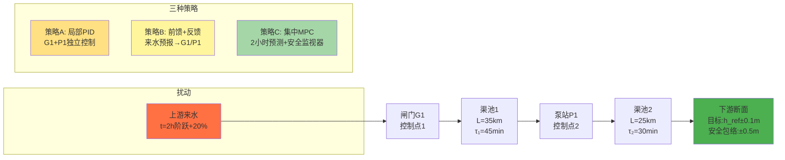

# 第二章算例拓扑图生成提示

## 图2-X: 算例系统拓扑与控制策略对比

**插入位置**：§2.8 "场景设定"段落之后

**图片类型**：系统拓扑 + 控制架构对比

**尺寸要求**：2400×1200 px（横向布局）

---

## 方案A：Mermaid 流程图（推荐，适合技术读者）



---

## 方案B：Gemini AI 生成（推荐，适合教材）

**English Prompt for Gemini:**

```
Create a detailed system topology diagram for a water conveyance case study with the following specifications:

LAYOUT: Horizontal flow (left to right), 2400×1200 px, clean engineering style

COMPONENTS (left to right):
1. Upstream Inflow (labeled "上游来水 Upstream Inflow")
   - Add annotation: "t=2h: +20% step disturbance"
   - Color: Orange (#FF7043)

2. Gate G1 (labeled "闸门G1 Gate G1" + "Control Point 1")
   - Icon: Vertical gate symbol
   - Color: Blue (#1565C0)

3. Canal Pool 1 (labeled "渠池1 Canal Pool 1")
   - Length: L=35 km
   - Time delay: τ₁=45 min
   - Show as trapezoid channel cross-section
   - Color: Light blue water

4. Pump Station P1 (labeled "泵站P1 Pump Station P1" + "Control Point 2")
   - Icon: Pump symbol with impeller
   - Color: Blue (#1565C0)

5. Canal Pool 2 (labeled "渠池2 Canal Pool 2")
   - Length: L=25 km
   - Time delay: τ₂=30 min
   - Show as trapezoid channel cross-section
   - Color: Light blue water

6. Downstream Target (labeled "下游断面 Downstream Section")
   - Target: h_ref ± 0.1 m
   - Safety envelope: ± 0.5 m
   - Color: Green (#4CAF50)
   - Add level indicator showing target and limits

CONTROL STRATEGY COMPARISON (bottom panel):
Create three columns showing:

Column 1 - Strategy A (策略A: 局部PID Local PID):
- Two independent PID controllers (one for G1, one for P1)
- Feedback-only architecture
- Color: Light yellow (#FFE082)
- Show local feedback loops

Column 2 - Strategy B (策略B: 前馈+反馈 Feedforward+Feedback):
- PID controllers with feedforward from upstream inflow
- Show feedforward path from inflow to both G1 and P1
- Color: Pale yellow (#FFF59D)

Column 3 - Strategy C (策略C: 集中MPC Centralized MPC):
- Centralized MPC block coordinating G1 and P1
- 2-hour prediction horizon
- Safety monitor
- Color: Light green (#A5D6A7)
- Show information flow from both canal pools to MPC

ANNOTATIONS:
- Add arrows showing water flow direction
- Label time delays on canal pools
- Add Chinese+English bilingual labels
- Use clean, modern engineering diagram style
- Include legend explaining control points and performance metrics

PERFORMANCE COMPARISON TABLE (below diagram):
Three-column table showing:
- Peak deviation: A(0.25m) vs B(0.12m) vs C(0.06m)
- Start/stop count: A(8/8h) vs B(5/8h) vs C(2/8h)
- Energy penalty: A(+30%) vs B(+12%) vs C(+3%)

Use consistent color scheme: water=#1565C0, control=#4CAF50, disturbance=#FF7043
```

---

## 方案C：HTML/SVG 精确绘制（备选）

如果需要可编辑、精确对齐的版本，可以用 HTML+SVG 绘制，但 Gemini 生成的插图对教材更友好（有立体感、易读）。

---

## 使用建议

1. **首选 Gemini**：适合教材出版，视觉效果最佳
2. **备选 Mermaid**：适合在线文档、技术报告，易于修改
3. 生成后保存为 `fig_02_case_topology.png`
4. 在 ch02_final.md 的 "场景设定" 段落后插入：
   ```markdown
   
   ```

---

**文件创建时间**: 2026-02-25 06:35
**对应章节**: ch02_final.md §2.8
**图片编号**: 图2-X（待分配最终编号）
