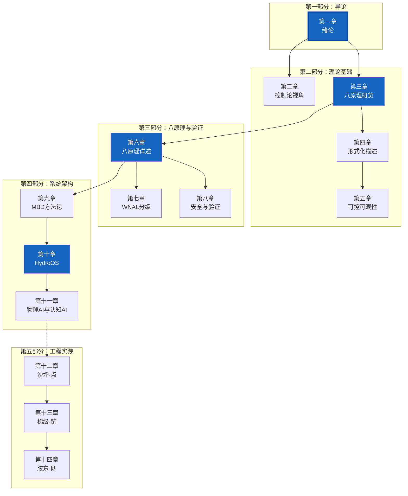
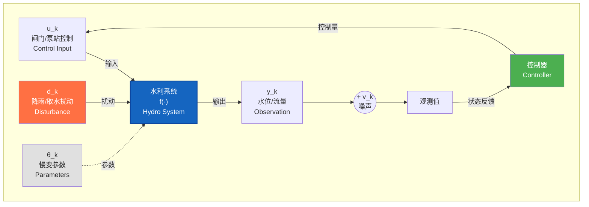
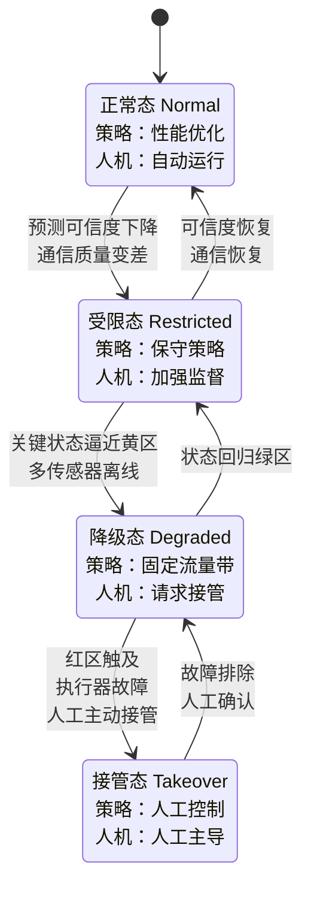
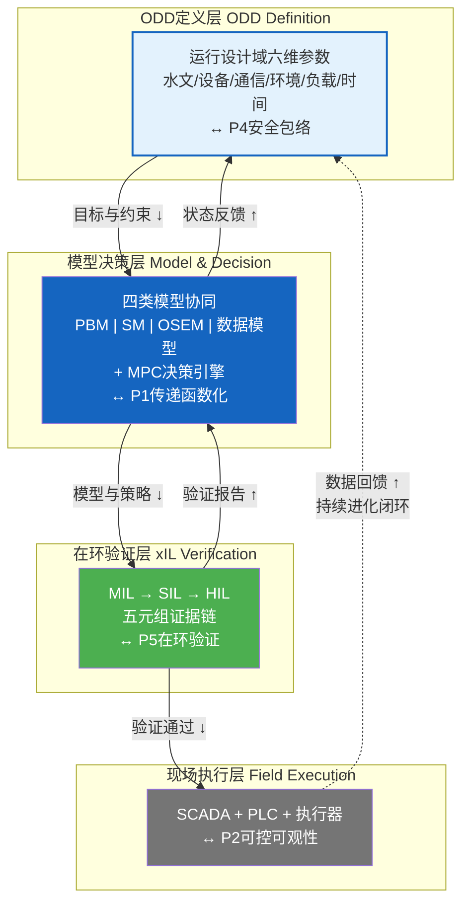
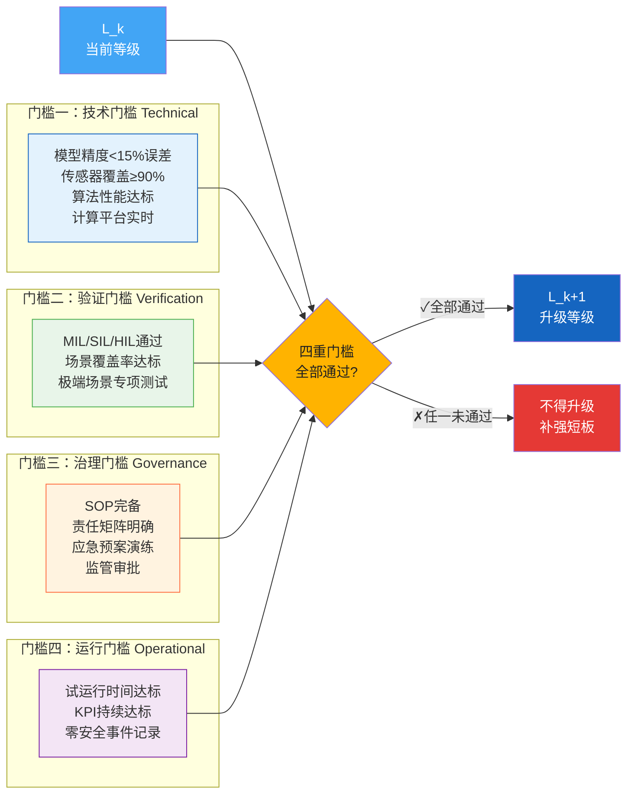
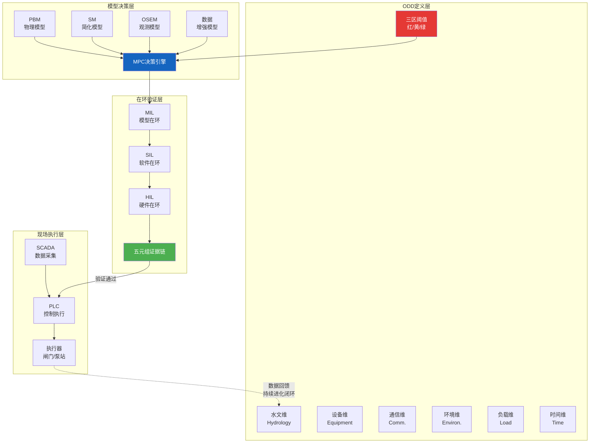
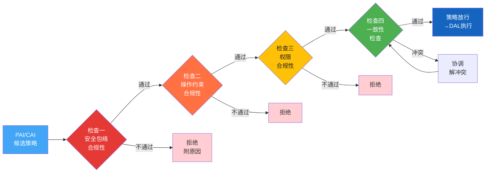
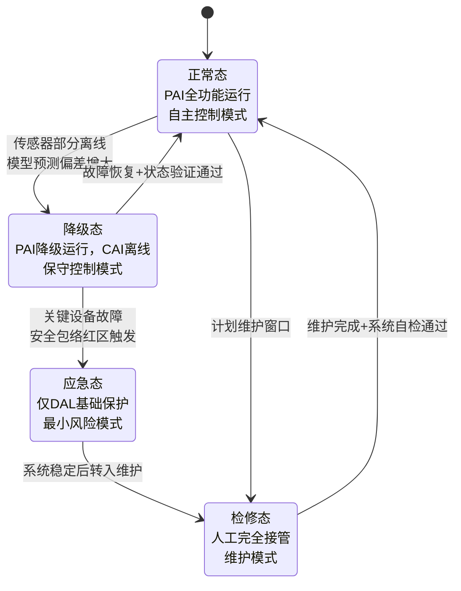
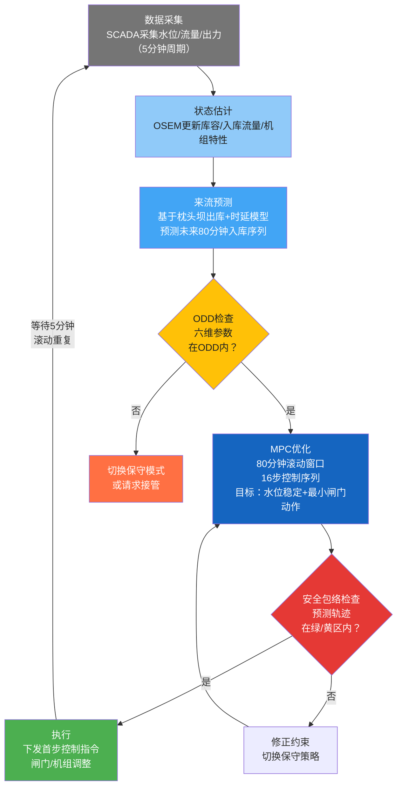
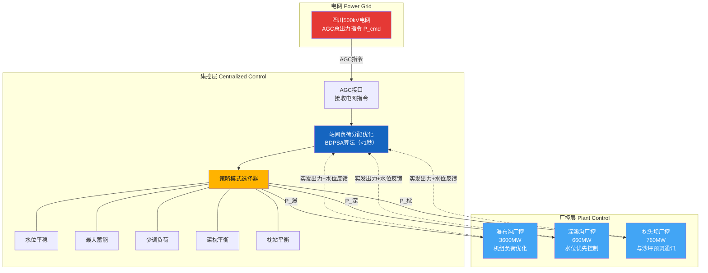

# T1-CN Mermaid 代码生成插图

> 使用方法：
> 1. 复制对应代码块到 mermaid.live 或 VS Code Mermaid 插件
> 2. 导出为 PNG（背景白色，宽度≥1800px）
> 3. 也可用 `mmdc` CLI 工具批量渲染：
>    `npx -p @mermaid-js/mermaid-cli mmdc -i input.mmd -o output.png -w 2400 -b white`

---

## 图 1-6: 章节依赖关系（DAG）

---

## 图 2-1: 水系统状态—输入—输出—扰动框图

---

## 图 2-4: 异常工况四态机状态迁移图

---

## 图 3-2: MBD 四层一闭环架构

---

## 图 7-2: WNAL 等级跃迁四重门槛

---

## 图 9-2: MBD "四层一闭环"总体框架（详细版）

---

## 图 10-2: 策略门禁四项检查流程

---

## 图 10-3: HydroOS 四态机状态转换图

---

## 图 12-3: 沙坪 MPC 滚动优化控制流程

---

## 图 13-2: 梯级 EDC 两级架构

