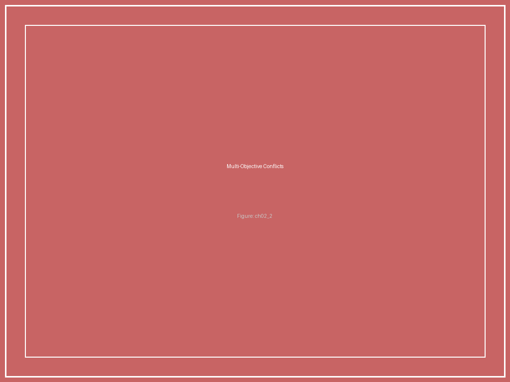
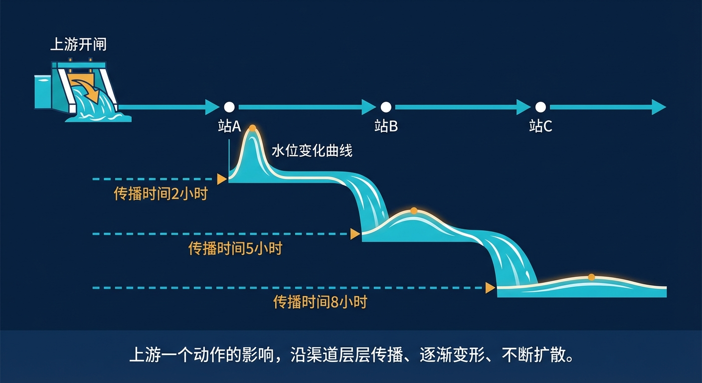

# 第2章 图片索引

**图2-1　时滞对比图：水系统 vs 电力系统 vs 化工系统**

*时滞对比图：水系统 vs 电力系统 vs 化工系统*

**图2-2　一个闸门同时面对的多重约束**

*一个闸门同时面对的多重约束*

**图2-3　五个控制本质"五角星"示意图**

*五个控制本质"五角星"示意图*

**图2-4　"开闸→水位变化→下游影响"的时间线瀑布图**

*"开闸→水位变化→下游影响"的时间线瀑布图*
