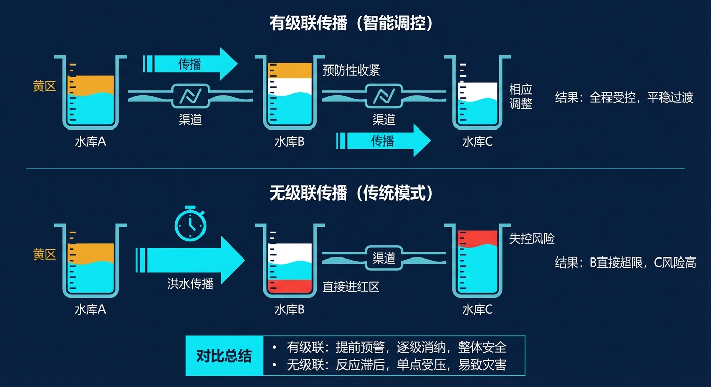
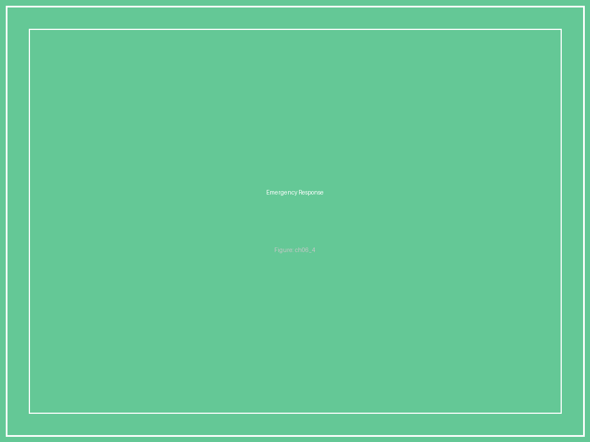

# 第6章 图片索引

**图6-1　红黄绿三区示意图：以水库水位为例**

*红黄绿三区示意图：以水库水位为例*

**图6-2　安全包络的"嵌套关系"**

*安全包络的"嵌套关系"*

**图6-3　约束传播示意：上游超标如何级联影响下游**

*约束传播示意：上游超标如何级联影响下游*

**图6-4　安全降级路径图：从正常运行到最小风险状态**

*安全降级路径图：从正常运行到最小风险状态*
