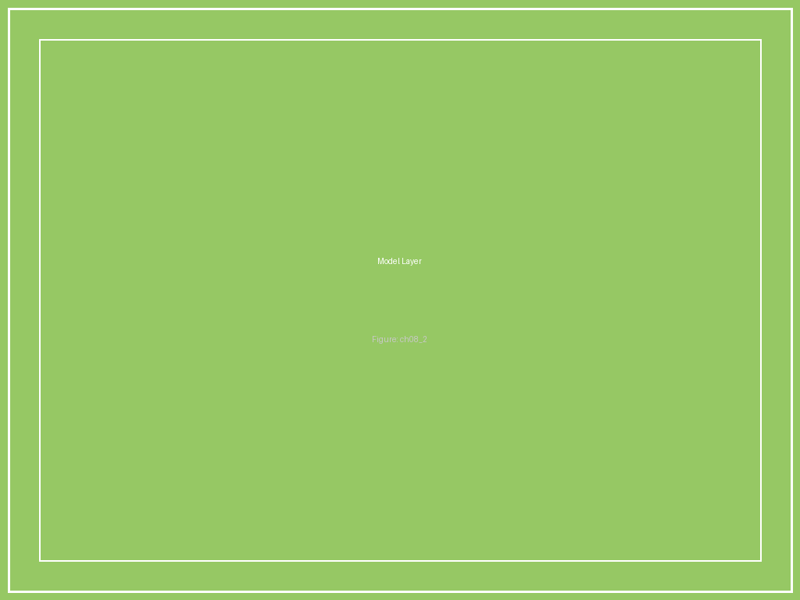
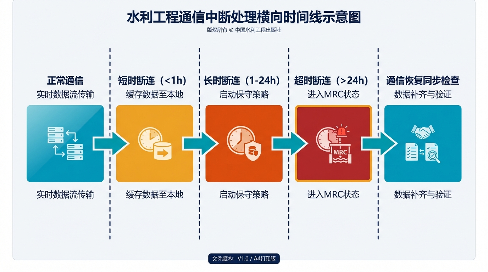

# 第8章 图片索引

**图8-1　HydroOS三层架构（对比手机操作系统）**

*HydroOS三层架构（对比手机操作系统）*

**图8-2　四态机状态转换图**

*四态机状态转换图*

**图8-3　HydroOS与SCADA的关系：叠加而非替代**

*HydroOS与SCADA的关系：叠加而非替代*

**图8-4　物理AI与认知AI的职责分界**

*物理AI与认知AI的职责分界*

**图8-5　断连自治的三级降级策略**

*断连自治的三级降级策略*
